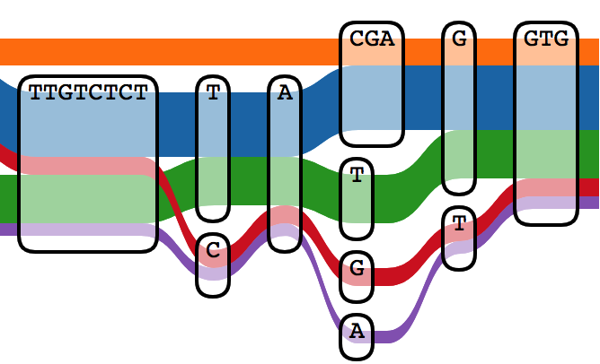
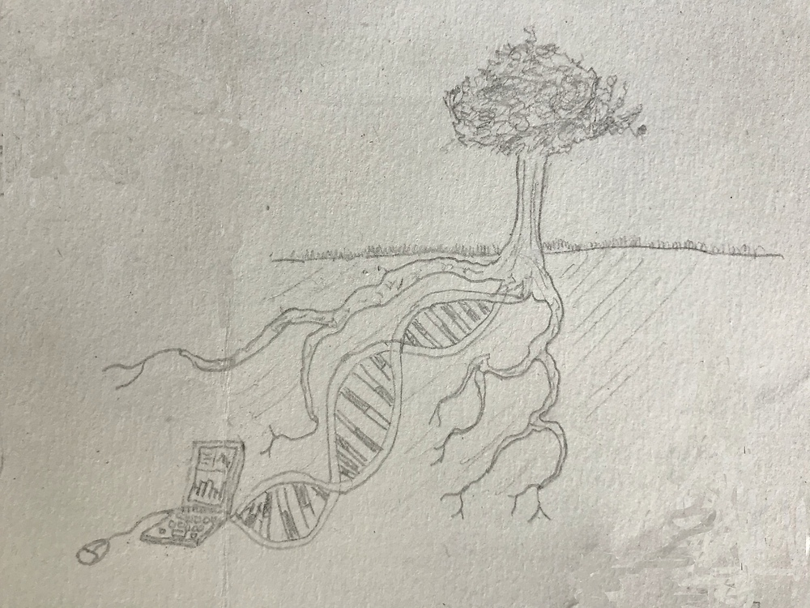

Our group is part of the USDA's Agricultural Research Service (ARS), and we are closely affiliated with the University of Georgia in Athens, Georgia.  We have lab-specific research interests but also contribute bioinformatic and design support for many ARS projects across the Southeastern United States.  Please contact us with questions, particularly if you are looking for graduate or postdoctoral experience that intersects crop improvement, genomics, and bioinformatics.  

## People

| [Justin Vaughn, Principal Investigator](./pages/jnvBio.md) | [Andrew Ontano, Postdoctoral Researcher](https://scholar.google.com/citations?user=sB6Y-j8AAAAJ&hl=en&oi=sra) |
| :---: | :---: |
|  |  |

|  [Brian Abernathy, Bioinformatician](https://scholar.google.com/citations?user=D6omdmYAAAAJ) |
| :---: |
|  |

## Projects

| [Iterative QTL-seq applied to multi-genic traits in peanut and rice](./pages/iQTL.md) | [Historical genomics of complex traits in soybean and rice](./pages/histGenomics.md) | [Gene Sieve: Fully exploiting model systems for gene identification](./pages/leapFrog.md) |
| :---: | :---: | :---: |
|  |  |  |

| [Gene annotation and effect prediction in pan-genomic context](./pages/panGenome.md) | [Simulation and visualization of controlled crosses](./pages/simAndVis.md)  | [Fast-forward genetics in sorghum and peach](./pages/ffGenetics.md) |
| :---: | :---: | :---: |
|  |  |  |

## Publications
[Google Scholar summary](https://scholar.google.com/citations?hl=en&user=Udhv0SkAAAAJ&view_op=list_works&sortby=pubdate)

## Software

[PanPipes](https://github.com/USDA-ARS-GBRU/PanPipes)
Graph-enabled genotyping in a comparative genomics framework

[Crossword](https://github.com/USDA-ARS-GBRU/crossword)
A genomics-enabled simulation language for design and optimization of breeding schemes and genetic mapping experiments

[QTLsurge](https://github.com/USDA-ARS-GBRU/QTLsurge)
Software for iterative genotyping design in a QTL-seq experiment

## Tutorials

[Using Galaxy on Ceres](./pics/galaxyOnCeres.pdf "Galaxy")

## Former Members

[Xuewen Wang, Research Associate](https://scholar.google.com/citations?user=jXfdcm0AAAAJ&hl=en) (now at [Center for Human Identification](https://www.unthsc.edu/center-for-human-identification/))

[Brian Nadon, Postdoctoral Research Associate](https://www.linkedin.com/in/brian-nadon-3b205470) (now at [Thermo Fisher Scientific](https://www.linkedin.com/company/thermo-fisher-scientific?trk=public_profile_topcard-current-company))

[Walid Korani, Postdoctoral Research Associate](https://github.com/w-korani) (now at [HudsonAlpha](https://www.hudsonalpha.org/))

## The Basic Idea

by Waylon Vaughn
