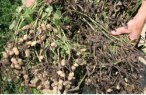
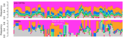
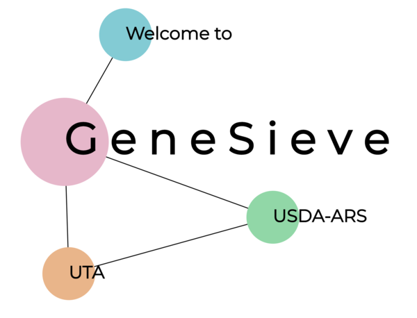
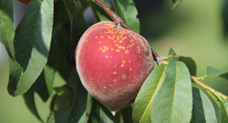

Our group is part of the USDA's Agricultural Research Service (ARS), and we are closely affiliated with the University of Georgia in Athens, Georgia.  We have lab-specific research interests but also contribute bioinformatic and design support for many ARS projects across the Southeastern United States.  Please contact us with questions, particularly if you are looking for graduate or postdoctoral experience that intersects crop improvement, genomics, and bioinformatics.  

## People

| [Justin Vaughn, Principal Investigator](./pages/jnvBio.md) | [Walid Korani, Postdoctoral Research Associate](https://github.com/w-korani) |
| :---: | :---: |
|  |  |

## Projects

| [Iterative QTL-seq applied to multi-genic traits in peanut and rice](./pages/iQTL.md) | [Historical genomics of complex traits in soybean and rice](./pages/histGenomics.md) | [Gene Sieve: Fully exploiting model systems for gene identification](./pages/leapFrog.md) |
| :---: | :---: | :---: |
|  |  |  |

| [Simulation and visualization of controlled crosses](./pages/simAndVis.md) (See recent [publication](https://www.nature.com/articles/s41598-018-38348-y)) | [Fast-forward genetics in sorghum and peach](./pages/ffGenetics.md) |
| :---: | :---: |
|  |  |

## Software

[Crossword](https://github.com/USDA-ARS-GBRU/crossword)
A genomics-enabled simulation language for design and optimization of breeding schemes and genetic mapping experiments

## Tutorials

[Using Galaxy on Ceres](./pics/galaxyOnCeres.pdf "Galaxy")

