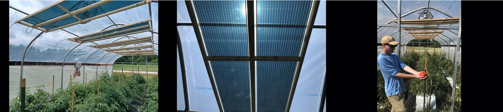

# Agrivoltaics for southeastern US vegetable production

## Project Summary

Though high-tunnels have numerous agronomic benefits, they also require large upfront costs. Moreover, to manage summer temperatures, active ventilation and, therefore, an energy source are required.  We are evaluating photovoltaic high-tunnel designs that would eliminate the logistical and financial burden of electric grid and water-well installation.  Indeed, as electric farm machinery comes online, we look forward to farming systems that produce all the energy they require, while maintaining current crop yields.

To achieve these competing goals, solar power production cannot adversely affect crops.  Interestingly, most crops receive more sun than they can convert to chemical energy.  This gap is most extreme around noon, when extreme solar radiation can actually be detrimental.  Still, all crops show reductions in yield related to hard-shading seen in other conventional agrivoltaic environments.  We find this observation odd given that, in high tunnel environments, growers often provide additional shade to improve marketable yields. We suspect this paradox is a product of the improved growing conditions counterbalanced by reduced light. Regardless, this situation suggest that we can exploit the light “surplus” for energy production, while maintaining or even improving yields.

When attempting to balance light availability and growth, conventional solar panels spaced in sparse patterns can create patches of hard shade and hard light, which are likely detrimental to marketable yield.  This problem has inspired us to explore semi-transparent, flexible photovoltaic material.  Non-silicon based solar cells or “organic photovoltaics” have these properties by default and have recently emerged in commercial production.  Eventually, they are expected to surpass silicon photovoltaics in affordability due to ease of manufacture.  We are currently testing multiple crop varieties under this technology relative to conventional photovoltaics.  

These growing systems are quite different from open fields, where crops have been historically selected.  In addition to structural aspects above, we want to know if differential performance in high-tunnels has a genetic basis and, if so, what are those underlying genes.

[Contact us](mailto:jnvaughn@uga.edu) for a site visit.

## Collaborators

Kate Cassity-Duffey, UGA

Eshwar Ravishankar, NC-State / Cal Poly Pomona

[Return to home page](https://genemachine.net)
